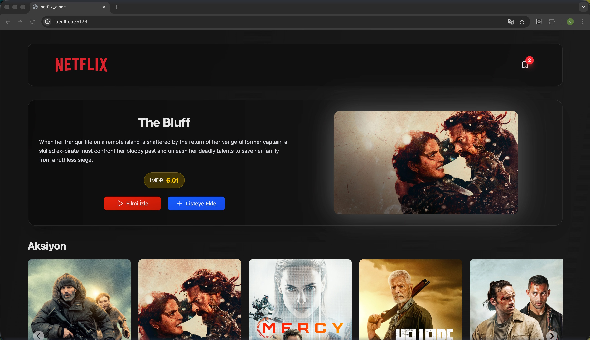

## 🎬 Netflix Clone - React & Redux

- Bu proje, TMDB (The Movie Database) API'sini kullanarak hazırlanan, kullanıcıların popüler filmleri keşfetmesine, detaylarını incelemesine ve kendi izleme listelerini oluşturmasına olanak tanıyan modern bir web uygulamasıdır.

# 🎯 Projenin Amacı

- Proje, karmaşık bir asenkron veri akışını (API istekleri), merkezi state yönetimini (Redux) ve modern UI bileşenlerini bir araya getirerek gerçek dünya senaryosuna uygun bir dijital yayın platformu deneyimi sunmayı hedefler.

# 🚀 Öne Çıkan Özellikler

- Dinamik Ana Sayfa: Popüler, vizyondaki ve kategorize edilmiş filmlerin listelenmesi.

- İzleme Listesi (Watchlist): Redux Thunk kullanılarak API ile senkronize çalışan "Listeye Ekle/Çıkar" özelliği.

- Detay Sayfası: Filmin özeti, bütçesi, hasılatı ve oyuncu kadrosu gibi detaylı bilgiler.

- Responsive Tasarım: Tailwind CSS 4.0 ile mobil, tablet ve masaüstü cihazlar için tam uyumluluk.

- İnteraktif Slider: @splidejs kullanılarak hazırlanan akıcı film ve oyuncu listeleri.

- Hızlı Performans: Vite build aracı ve React 19'un sunduğu en güncel optimizasyonlar.

# 🛠 Kullanılan Teknolojiler

- Frontend & Core
- React 19: Modern UI bileşen yapısı.

- Vite: Hızlı geliştirme ve build süreci.

- Tailwind CSS 4.0: Modern ve özelleştirilebilir CSS utility yapısı.

- React Router Dom v7: Sayfalar arası dinamik yönlendirme.

# State Management

- Redux & React-Redux: Merkezi veri yönetimi.

- Redux Thunk: API istekleri gibi asenkron işlemlerin yönetimi.

# Yardımcı Kütüphaneler

- Axios: HTTP istekleri için kullanılan güçlü istemci.

- Lucide React: Minimalist ve şık ikon seti.

- Splide.js: Yüksek performanslı slider/carousel bileşenleri.

- Millify: Büyük sayıları (bütçe, hasılat) okunabilir formatlara dönüştürme (örn: 1.2M$).

# Ekran Görüntüsü

# GIFs

